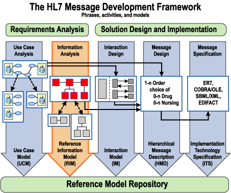
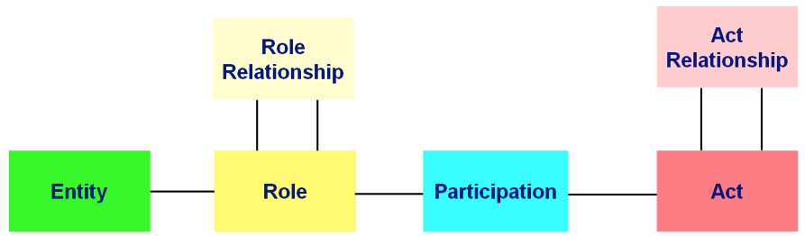
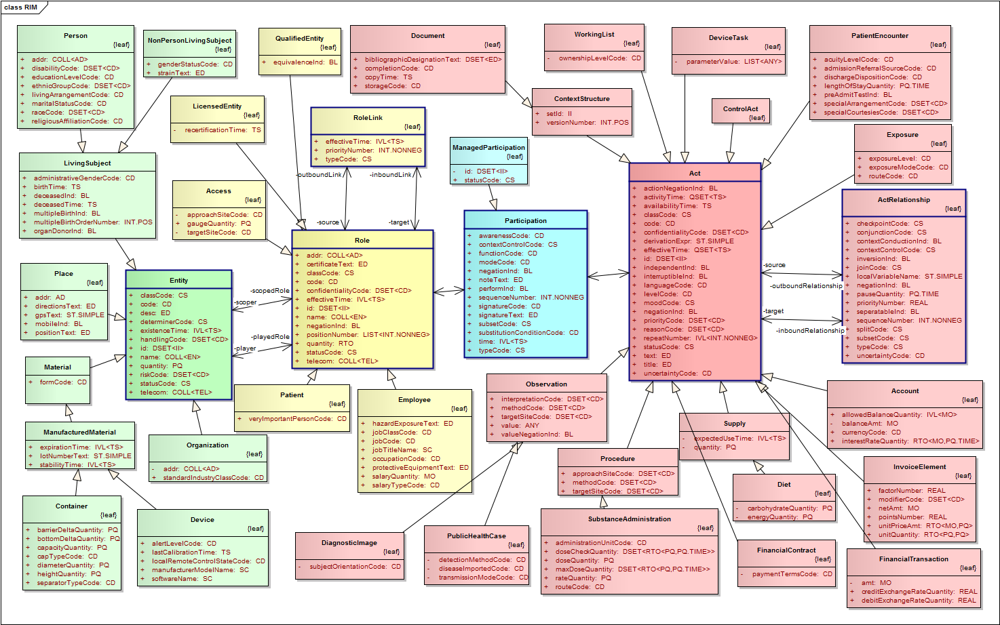
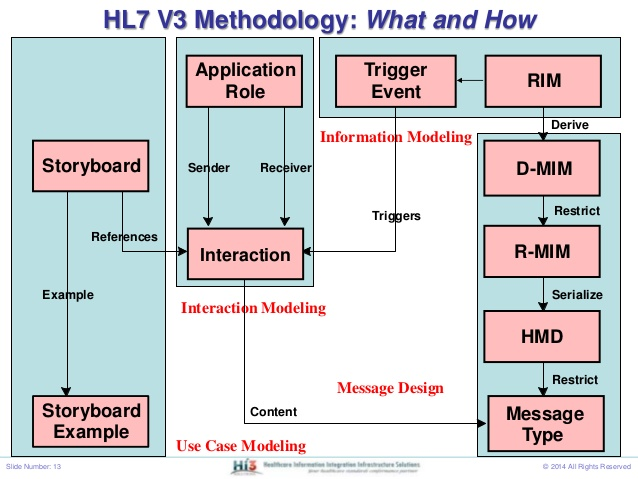
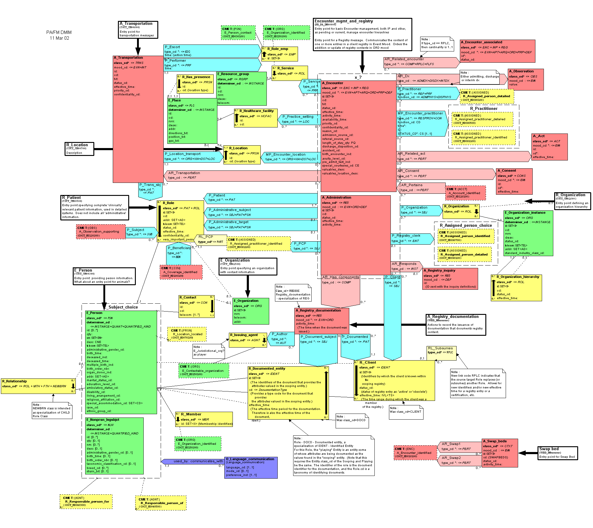

## HL7 v3

### History

Started in 1992 with first releases in 2005.
Based on a formal methodologies - epoch of overengeneering (UML, Case Tools and Patterns).

> If someone ever wants to get brainsick and/or feel defeated,
> the easiest way is to try to comprehend the UML metamodeling
> approach which is used by OMG to describe UML.

by [http://www.uml-diagrams.org/uml-meta-models.html]

* HDF methodology
* Model Driven & Object Oriented

### Methodology: HL7 Development Framework - ISO/HL7 27931 (HDF)

* Requirements Analysis
  * Use Cases (UCM)
  * Information Analysis (RIM)
* Solution Design
  * Interaction design (IM)
  * Message design (HMD)
  * Message secs (ITS)

### Reference Information Model

### Message Desing Process

* Story Board - Interaction - Appication Role - Trigger Event

* RIM
* D-MIM
* R-MIM
* HMD
* Message

Example resulting d-mim:

### [CDA](http://www.hl7.org/implement/standards/product_brief.cfm?product_id=7)

The HL7 Version 3 Clinical Document Architecture (CDA®) is a document markup standard
that specifies the structure and semantics of "clinical documents" for the purpose of
exchange between healthcare providers and patients.
It defines a clinical document as having the following six characteristics:

1. Persistence
2. Stewardship
3. Potential for authentication
4. Context
5. Wholeness
6. Human readability

### Messaging & Documents

http://www.ringholm.de/docs/04200_en.htm

### IHE Profiles

TODO: http://www.ringholm.de/en/whitepapers.htm

http://en.wikipedia.org/wiki/Integrating_the_Healthcare_Enterprise
