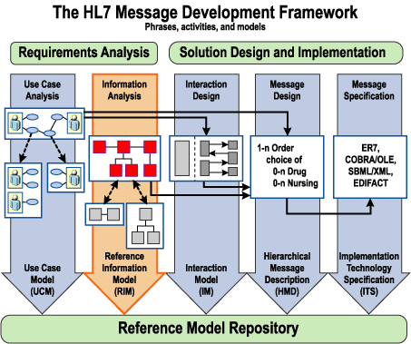
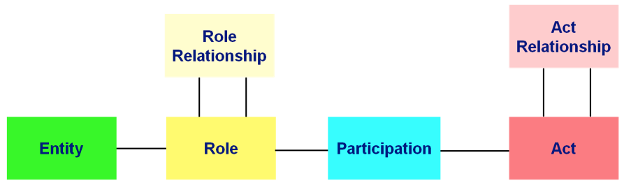
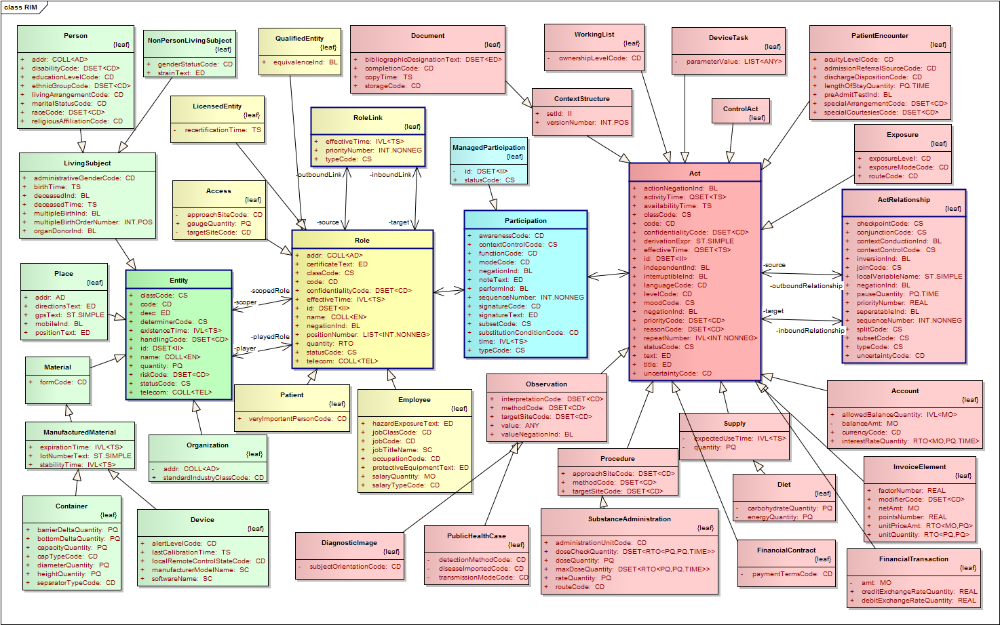
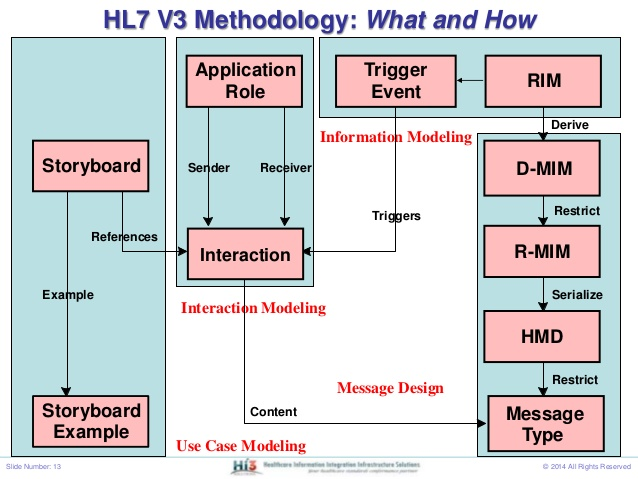
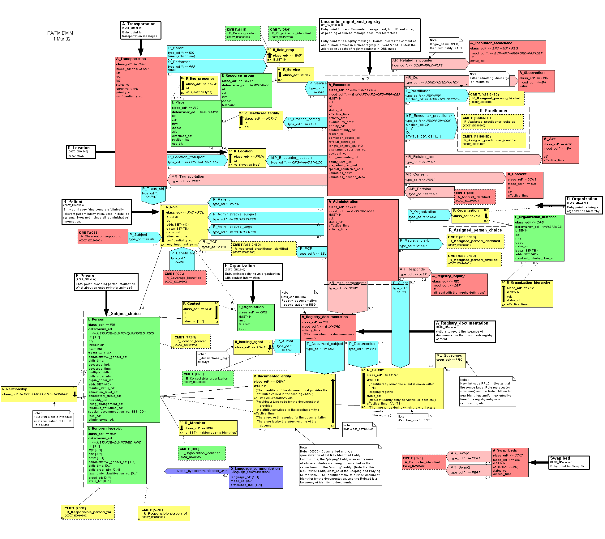

## HL7 v3

### History

Started in 1992 with first releases in 2005.
Based on a formal methodologies - epoch of overengeneering (UML, Case Tools and Patterns).

> If someone ever wants to get brainsick and/or feel defeated,
> the easiest way is to try to comprehend the UML metamodeling
> approach which is used by OMG to describe UML.

by [http://www.uml-diagrams.org/uml-meta-models.html]

* HDF methodology
* Model Driven & Object Oriented

### Methodology: HL7 Development Framework - ISO/HL7 27931 (HDF)

* Requirements Analysis
  * Use Cases (UCM)
  * Information Analysis (RIM)
* Solution Design
  * Interaction design (IM)
  * Message design (HMD)
  * Message secs (ITS)

### Reference Information Model

### Message Desing Process

* Story Board - Interaction - Appication Role - Trigger Event

* RIM
* D-MIM
* R-MIM
* HMD
* Message

Example resulting d-mim:

[next](cda.md)
