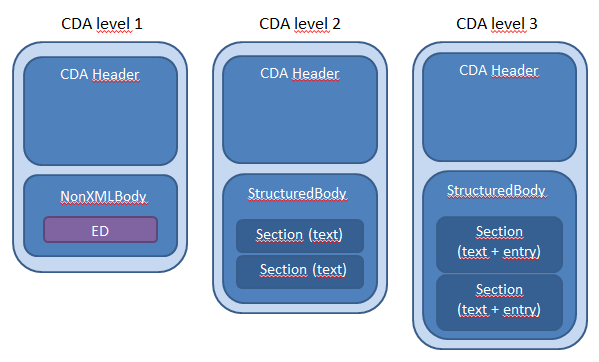
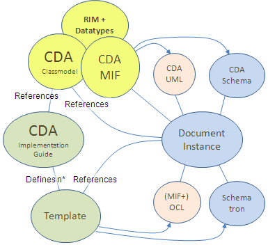
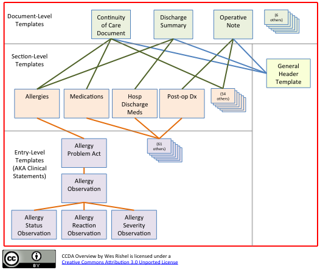
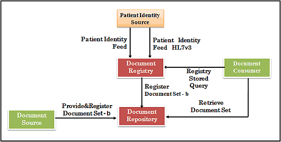

### [CDA](http://www.hl7.org/implement/standards/product_brief.cfm?product_id=7)

The HL7 Version 3 Clinical Document Architecture (CDA®) is a document markup standard
that specifies the structure and semantics of "clinical documents" for the purpose of
exchange between healthcare providers and patients.
It defines a clinical document as having the following six characteristics:

1. Persistence
2. Stewardship
3. Potential for authentication
4. Context
5. Wholeness
6. Human readability

### Levels

### Templates

### CCD

Continuity of Care Document [hl7](http://www.hl7.org/implement/standards/product_brief.cfm?product_id=6)

### IHE XDS

[next](04-messaging-or-documents.md)
